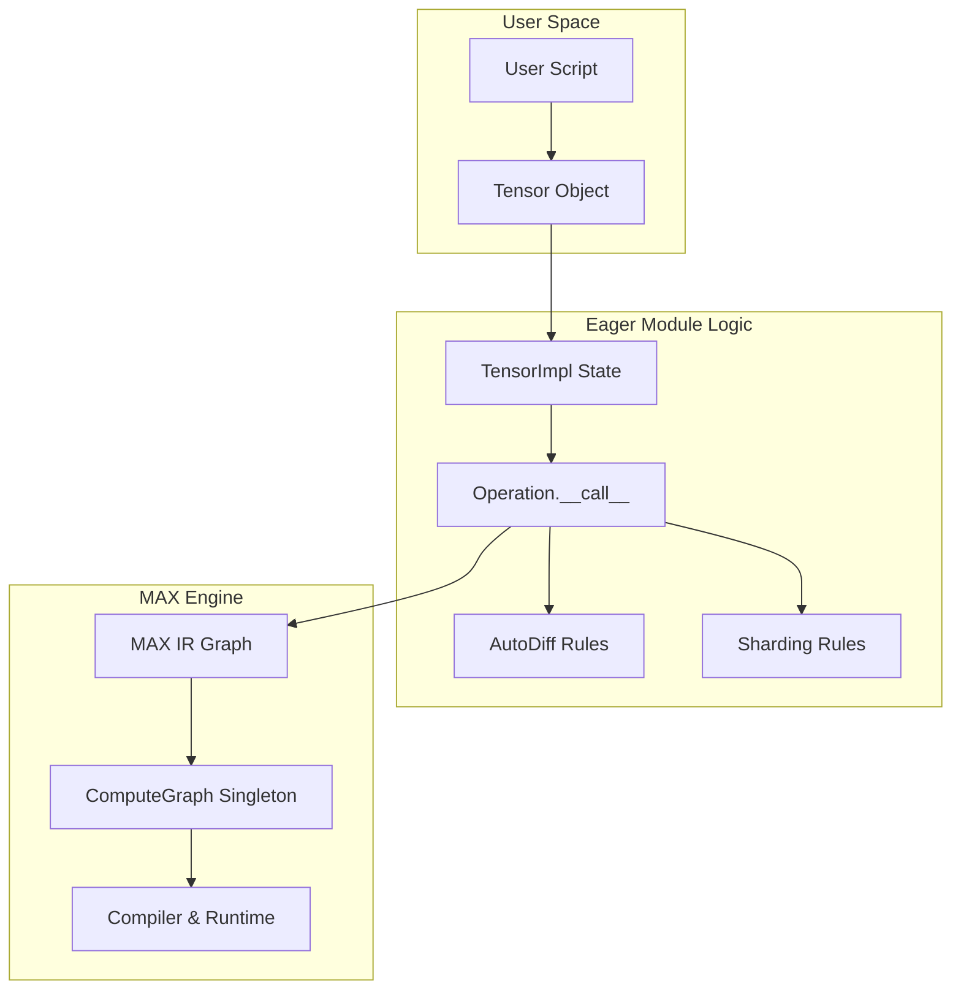
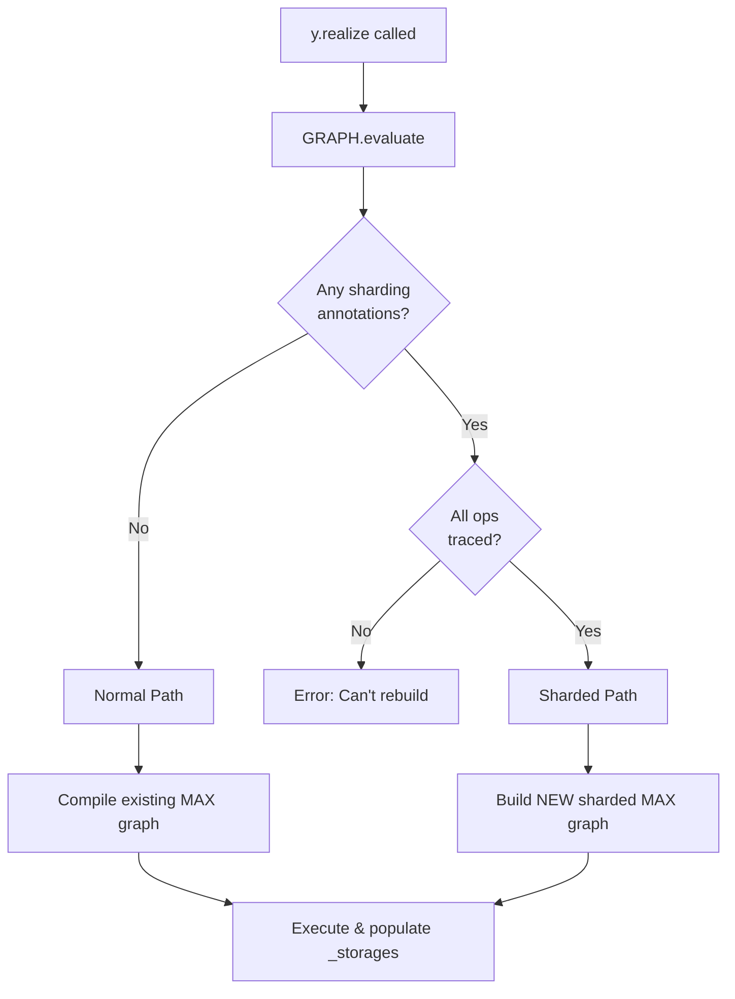

# Eager Module Architecture

This document comprehensively explains the architecture of the `eager` module. It is designed to implement a **Lazy Eager** framework, targeting the usability of PyTorch with the optimization capabilities of JAX.

## 1. Project Structure

The module is flat and modular, designed to minimize circular dependencies while keeping related logic distinct.

```text
eager/
├── tensor.py          # User Functionality: The PUBLIC API (Tensor class)
├── tensor_impl.py     # System Logic: The STATE & LOGIC (TensorImpl class)
├── ops.py             # Dispatcher: Base class for operations & autograd rules
├── binary_ops.py      # Implementation: Concrete op implementations (Add, Mul...)
├── compute_graph.py   # Engine: Computation graph manager & compilation entry point
├── context.py         # Utilities: Thread-local settings (device, dtype)
├── pytree.py          # Utilities: JAX-compatible tree flattening/unflattening
├── sharding.py        # Sharding: Core state definitions (DeviceMesh, ShardingSpec)
├── sharding_propagation.py # Sharding: Propagation logic and templates
└── shardy/            # (Removed)

```

## 2. Core Philosophy

The `eager` module separates the **API (User View)** from the **Execution (System View)**.

-   **User View**: "I am creating arrays and adding them immediately."
-   **System View**: "I am recording a graph of operations. I will only compile and run them when the user asks for the concrete data (e.g., printing, `.item()`)."

This **Lazy Eager** approach allows us to:
1.  **Capture the full graph** without `torch.compile` or `fax.jit` decorators.
2.  **Optimize globally** using the MAX compiler stack.
3.  **Retain imperative debugging** users can insert `print()` or breakpoints, and the graph construction will simply pause until that generic Python code executes.

## 3. Architecture Deep Dive

### The Four Pillars

#### 1. `Tensor` (The Facade)
*Location: `eager/tensor.py`*
*   **Role**: The user-facing object. It mimics `torch.Tensor`.
*   **Behavior**: It is a thin wrapper. It holds **no state** governing the graph or data. It only holds a reference to `_impl`.
*   **Key Feature**: It implements `__add__`, `__mul__`, etc., by delegating to the `binary_ops` module, which returns new `Tensor` instances.

#### 2. `TensorImpl` (The Brain)
*Location: `eager/tensor_impl.py`*
*   **Role**: The internal state container.
*   **State Machine**:
    *   **Unrealized**: Holds `_values` (Symbolic graph nodes).
    *   **Realized**: Holds `_storages` (Concrete `driver.Tensor` data).
*   **Graph Node**: If `traced=True`, it stores:
    *   `parents`: List of input `TensorImpl`s.
    *   `op`: The operation that produced it.
    *   This storage enables the reconstruction of the graph for backpropagation.

#### 3. `Operation` (The Dispatcher)
*Location: `eager/ops.py`*
*   **Role**: A stateless definition of a transformation.
*   **The Interface**:
    1.  `maxpr(*inputs)`: **Lowering**. Defines how to translate this op into MAX graph nodes.
    2.  `vjp_rule(...)`: **Reverse-Mode**. Defines the gradient (vector-jacobian product).
    3.  `jvp_rule(...)`: **Forward-Mode**. Defines the tangent push-forward.
    4.  `sharding_rule(...)`: **Distribution**. Defines how data is split across devices.

#### 4. `ComputeGraph` (The Engine)
*Location: `eager/compute_graph.py`*
*   **Role**: A singleton (`GRAPH`) managing the current compilation context.
*   **Lifecycle**:
    *   Accumulates `max.graph.ops` as the user runs Python code.
    *   When `tensor.item()` or `sys.print(tensor)` is called, it triggers `evaluate()`, which compiles the graph, executes it, and populates the `_storages` of all pending tensors.

## 4. Key Mechanisms

### A. The "Lazy Eager" Lifecycle of `z = x + y`

1.  **Python Dispatch**: `x.__add__(y)` calls `binary_ops.add(x, y)`.
2.  **Op Call**: `AddOp.__call__(x, y)` starts.
3.  **Graph Entry**: The system enters the global `GRAPH` context.
4.  **Lowering**: calls `AddOp.maxpr(x.value, y.value)`. This adds an `add` node to the MAX graph. It returns a symbolic `TensorValue`.
5.  **Wrapping**: A new `TensorImpl` is created wrapping this `TensorValue`. It records `x` and `y` as parents if tracing is on.
6.  **Return**: A new `Tensor` wrapping the `TensorImpl` is returned to the user.
    *   *Note: No computation has happened yet. `z` is empty.*
7.  **Realization**: User prints `z`.
    *   `z` calls `GRAPH.evaluate(self)`.
    *   `z._impl._storages` is populated with the result.
    *   `z._impl._values` is cleared (graph is consumed).

### B. Logical vs. Physical Shapes (Auto-Vectorization)

The system separates the **Logical Shape** (what the user sees) from the **Physical Shape** (data on device) to support `vmap` (vectorization).

*   **Logic**: `physical_shape = (batch_dims...) + logical_shape`
*   **Mechanism**: `TensorImpl.batch_dims` stores the number of prefix dimensions that are "batch" dimensions. Operations broadcast or map over these dimensions automatically during lowering.

### C. Dependency Visualization



## 5. Comparison: Why this is "Best of Both Worlds"

We aim to encapsulate the flexibility of PyTorch with the functional purity of JAX.

| Feature Approach | **PyTorch Style** | **JAX Style** | **Nabla Eager (Our Approach)** |
| :--- | :--- | :--- | :--- |
| **User Mental Model** | "I am manipulating data." | "I am defining a function." | "I am manipulating data." (Imperative) |
| **Execution Reality** | Eager (Line-by-line). | Staged (Traced -> JIT -> Run). | **Lazy** (Line-by-line -> Graph -> Run). |
| **Gradients** | `.backward()` on a tensor (Imperative). | `grad(func)` transformation (Functional). | **Both**. We support `Tensor.backward()` (via `parents` graph) AND `grad(func)` (via graph transformation). |
| **Vectorization** | `vmap` is added on top. | `vmap` is core to the design. | **Core**. `batch_dims` exists on every tensor low-level to support intrinsic vectorization. |
| **Sharding** | `DTensor` (Mesh based). | `sharding_constraint` (Mesh based). | **Intrinsic**. `TensorImpl.sharding` is a first-class citizen of the tensor state. |

### Sharding Architecture
| Component | Implementation | Key Properties |
| :--- | :--- | :--- |
| **Physical** | `sharding.DeviceMesh` | Logical view of devices (e.g., 2x4 mesh). N-dimensional coordinates. |
| **Spec** | `sharding.ShardingSpec` | `sharding<@mesh, [dim_specs], replicated={axes}>`. Describes how a tensor is distributed. |
| **Storage** | `TensorImpl.sharding` | **Intrinsic**. Sharding is a first-class citizen of variable state. |
| **Logic** | `sharding_propagation` | Contains `OpShardingRuleTemplate` and `propagate_sharding` algorithm. |
| **Compiler** | `compute_graph.compile_with_sharding` | Multi-phase compiler: Graph Walk -> Propagation -> MAX Graph Rewrite. |

**Files**:
- `eager/sharding.py`: Core types (`DeviceMesh`, `ShardingSpec`, `DimSpec`).
- `eager/sharding_propagation.py`: Propagation engine and reusable templates.
- `eager/compute_graph.py`: Contains compilation entry point.


---

## Compilation Flow (Detailed)

Understanding the compilation flow is critical. There are **two phases** and **two paths**.

### Phase 1: Graph Construction (Cheap, No Compilation)

Every operation adds nodes to a MAX graph, but **nothing is compiled yet**.

```
User Code                    Internal State
──────────                   ──────────────
x = Tensor.zeros((4,8))      → TensorValue added to GRAPH.graph
                             → TensorImpl created with _values=[TensorValue]
                             → cached_shape = (4, 8)

y = add(x, x)                → ops.add() adds node to GRAPH.graph
                             → New TensorImpl: _values=[result], parents=[x._impl]
                             → cached_shape = (4, 8)

[Nothing compiled. Just symbolic graph nodes.]
```

### Phase 2: Realization (Decision Point)

When user requests data (`print(y)`, `y.item()`, etc.), `GRAPH.evaluate()` is called.



---

### Path A: Normal Compilation (No Sharding)

**When**: No tensor in the graph has a `sharding` annotation.

**Steps**:

| Step | Location | What Happens |
|------|----------|--------------|
| 1 | `evaluate()` | Collect all unrealized tensors from `GRAPH.unrealized` |
| 2 | `_needs_sharded_compilation()` | Check → returns `False` |
| 3 | `_evaluate_normal()` | Set outputs on existing MAX graph |
| 4 | `_core.lower()` | Remove dead values, optimize |
| 5 | `session.load(graph)` | **COMPILE** MAX graph to executable model |
| 6 | `model(inputs)` | **EXECUTE** on device |
| 7 | Post-process | Populate `_storages`, clear `_values`, reinit graph |

**Code path**: `compute_graph.py` → `_evaluate_normal()`

---

### Path B: Sharded Compilation

**When**: Any tensor in the graph has `sharding is not None`.

**Prerequisite**: All operation tensors must be `traced=True` (so we can walk parents).

**Steps**:

| Step | Location | What Happens |
|------|----------|--------------|
| 1 | `evaluate()` | Collect unrealized tensors |
| 2 | `_needs_sharded_compilation()` | Walk parents graph, detect sharding → returns `True` |
| 3 | `_collect_execution_graph()` | Build topological list of ops, stop at realized inputs |
| 4 | `_evaluate_sharded()` | **Currently**: Create dummy shards (zeros) |
| | | **TODO**: Run Shardy propagation |
| | | **TODO**: Build sharded MAX graph with local shapes |
| | | **TODO**: Insert collective ops (all-gather, reduce-scatter) |
| 5 | Compile | Compile the NEW sharded MAX graph |
| 6 | Execute | Execute sharded ops |
| 7 | Post-process | Populate `_storages` with list of per-device shards |

**Code path**: `compute_graph.py` → `_evaluate_sharded()`

---

### Graph Construction vs Compilation: Why Two Graphs?

```
┌─────────────────────────────────────────────────────────────────────────┐
│ EAGERLY BUILT MAX GRAPH (during user operations)                       │
│ ─────────────────────────────────────────────────                      │
│ Purpose: Shape oracle, record of operations                            │
│ Contains: Global shapes, unsharded ops                                 │
│ Used by: Normal path (compiled directly)                               │
│ Sharded path: NOT compiled, only used for shape info                   │
└─────────────────────────────────────────────────────────────────────────┘
                              │
           ┌──────────────────┴──────────────────┐
           ▼                                     ▼
┌─────────────────────┐              ┌─────────────────────────────────┐
│ NORMAL PATH         │              │ SHARDED PATH                    │
│ Compile as-is       │              │ Build NEW graph from:           │
│                     │              │   - TensorImpl.parents (ops)    │
│                     │              │   - TensorImpl.cached_shape     │
│                     │              │   - TensorImpl.sharding         │
│                     │              │ With: Local shapes + collectives│
└─────────────────────┘              └─────────────────────────────────┘
```

The key insight: **building a MAX graph is cheap** (just symbolic nodes). We only pay the cost of compilation once, at realize time, on whichever graph we actually need.

---

### Sharding Data Flow

```
1. Operation.__call__
   └─▶ maxpr() creates TensorValue (symbolic, global shape)
   └─▶ cache_metadata() stores shape/dtype/device in TensorImpl
   └─▶ User sets sharding: tensor._impl.sharding = spec

2. GRAPH.evaluate()
   └─▶ _collect_execution_graph(): Walk parents, find all ops
   └─▶ _needs_sharded_compilation(): Check for any sharding
   └─▶ If sharded:
       └─▶ For each unrealized tensor:
           └─▶ Use ShardingSpec + DistributedTensor to compute local shapes
           └─▶ Create driver.Tensor for each shard
           └─▶ Populate _storages as list

3. After evaluation:
   └─▶ tensor.shape → returns GLOBAL shape (from cached_shape)
   └─▶ tensor.local_shape(i) → returns shard i's shape
   └─▶ tensor._impl._storages → list of driver.Tensors (one per device)
```

---

### Usage Example

```python
from eager import Tensor, add, DeviceMesh, DimSpec, ShardingSpec

# Setup mesh: 2 devices along "x" axis
mesh = DeviceMesh("cluster", (2,), ("x",))
spec = ShardingSpec(mesh, [DimSpec(["x"]), DimSpec([])])

# Create sharded tensor
x = Tensor.zeros((4, 8), traced=True)
x._impl.sharding = spec

# Operations preserve global shape semantics
y = add(x, x)
y._impl.sharding = spec

# Before realize: shapes are global
print(y.shape)        # [4, 8] (global)

# Realize triggers sharded compilation
print(y)              # triggers GRAPH.evaluate()

# After realize: global shape preserved, local available
print(y.shape)        # [4, 8] (global)
print(y.local_shape(0))  # [2, 8] (shard 0)
print(y.local_shape(1))  # [2, 8] (shard 1)
print(y._impl.num_shards)  # 2
```

## 6. Guide to Extending

### Adding a New Operation

1.  Create a class inheriting from `eager.ops.Operation`.
2.  Implement `name` property.
3.  Implement `maxpr`: Use `max.graph.ops` to build the graph.
4.  (Optional) Implement `vjp_rule` for autograd support.
5.  Instantiate it as a singleton in your module (e.g., `add = AddOp()`).

```python
class MyOp(Operation):
    @property
    def name(self): return "my_op"

    def maxpr(self, x, y):
        # Define how this lowers to MAX
        return ops.some_max_op(x, y)

    def vjp_rule(self, primals, cotangent, output):
        # Define gradients
        x, y = primals
        return [cotangent * y, cotangent * x]
```

### Mixed Positional Arguments (JAX Convention)

`Operation.__call__` supports **mixed positional args** following JAX's convention:
- **Tensor args**: Converted to TensorValues and traced
- **Non-Tensor args**: Passed through as "static params" (shapes, axes, scalars)

```python
class ReshapeOp(Operation):
    @property
    def name(self): return "reshape"

    def maxpr(self, x, shape):
        # x is TensorValue, shape is tuple (passed through unchanged)
        return ops.reshape(x, shape)

# Usage: reshape_op(tensor, (3, 4))  # shape is static param
```

**Key points for static params:**
- Non-Tensor positional args pass directly to `maxpr`
- Static params are also available in `**kwargs`
- VJP/JVP `primals` list only contains Tensor inputs
- Static params accessible via `output.op_kwargs` in VJP/JVP rules

### Adding a Multi-Output Operation

Operations can return **pytrees** (tuples, lists, dicts) of TensorValues:

```python
class SplitOp(Operation):
    @property
    def name(self): return "split"

    def maxpr(self, x, *, num_splits: int, axis: int = 0):
        # Returns tuple of TensorValues
        chunk_size = int(x.type.shape[axis]) // num_splits
        split_sizes = [chunk_size] * num_splits
        return tuple(ops.split(x, split_sizes, axis))

    def vjp_rule(self, primals, cotangent, output):
        # cotangent is now a TUPLE matching output structure
        # Concatenate cotangent pieces back together
        return [ops.concat(cotangent, axis=output[0].op_kwargs['axis'])]
```

**Key points for multi-output ops:**
- `maxpr` can return any pytree (tuple, list, dict) of `TensorValue`s
- The `Operation.__call__` method wraps each `TensorValue` in a `Tensor`
- For VJP: `cotangent` and `output` have the same pytree structure as `maxpr`'s return
- All outputs are tracked in `GRAPH.unrealized` and realize together automatically

