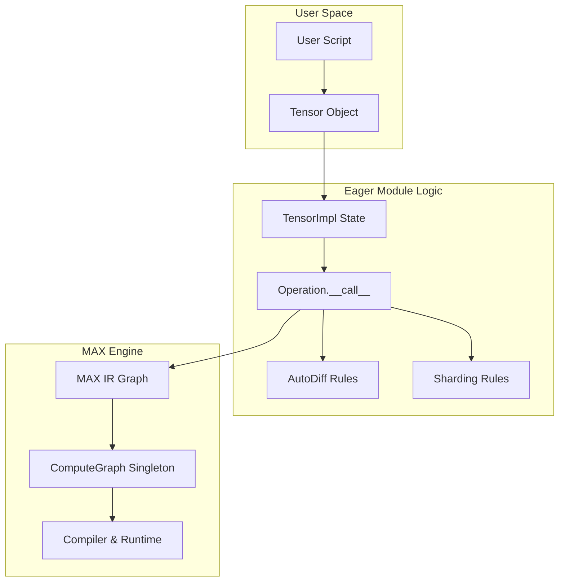

# Eager Module Architecture

This document comprehensively explains the architecture of the `eager` module. It is designed to implement a **Lazy Eager** framework, targeting the usability of PyTorch with the optimization capabilities of JAX.

## 1. Project Structure

The module is flat and modular, designed to minimize circular dependencies while keeping related logic distinct.

```text
eager/
├── tensor.py          # User Functionality: The PUBLIC API (Tensor class)
├── tensor_impl.py     # System Logic: The STATE & LOGIC (TensorImpl class)
├── ops.py             # Dispatcher: Base class for operations & autograd rules
├── binary_ops.py      # Implementation: Concrete op implementations (Add, Mul...)
├── compute_graph.py   # Engine: Computation graph manager & compilation entry point
├── context.py         # Utilities: Thread-local settings (device, dtype)
└── pytree.py          # Utilities: JAX-compatible tree flattening/unflattening
```

## 2. Core Philosophy

The `eager` module separates the **API (User View)** from the **Execution (System View)**.

-   **User View**: "I am creating arrays and adding them immediately."
-   **System View**: "I am recording a graph of operations. I will only compile and run them when the user asks for the concrete data (e.g., printing, `.item()`)."

This **Lazy Eager** approach allows us to:
1.  **Capture the full graph** without `torch.compile` or `fax.jit` decorators.
2.  **Optimize globally** using the MAX compiler stack.
3.  **Retain imperative debugging** users can insert `print()` or breakpoints, and the graph construction will simply pause until that generic Python code executes.

## 3. Architecture Deep Dive

### The Four Pillars

#### 1. `Tensor` (The Facade)
*Location: `eager/tensor.py`*
*   **Role**: The user-facing object. It mimics `torch.Tensor`.
*   **Behavior**: It is a thin wrapper. It holds **no state** governing the graph or data. It only holds a reference to `_impl`.
*   **Key Feature**: It implements `__add__`, `__mul__`, etc., by delegating to the `binary_ops` module, which returns new `Tensor` instances.

#### 2. `TensorImpl` (The Brain)
*Location: `eager/tensor_impl.py`*
*   **Role**: The internal state container.
*   **State Machine**:
    *   **Unrealized**: Holds `_values` (Symbolic graph nodes).
    *   **Realized**: Holds `_storages` (Concrete `driver.Tensor` data).
*   **Graph Node**: If `traced=True`, it stores:
    *   `parents`: List of input `TensorImpl`s.
    *   `op`: The operation that produced it.
    *   This storage enables the reconstruction of the graph for backpropagation.

#### 3. `Operation` (The Dispatcher)
*Location: `eager/ops.py`*
*   **Role**: A stateless definition of a transformation.
*   **The Interface**:
    1.  `maxpr(*inputs)`: **Lowering**. Defines how to translate this op into MAX graph nodes.
    2.  `vjp_rule(...)`: **Reverse-Mode**. Defines the gradient (vector-jacobian product).
    3.  `jvp_rule(...)`: **Forward-Mode**. Defines the tangent push-forward.
    4.  `sharding_rule(...)`: **Distribution**. Defines how data is split across devices.

#### 4. `ComputeGraph` (The Engine)
*Location: `eager/compute_graph.py`*
*   **Role**: A singleton (`GRAPH`) managing the current compilation context.
*   **Lifecycle**:
    *   Accumulates `max.graph.ops` as the user runs Python code.
    *   When `tensor.item()` or `sys.print(tensor)` is called, it triggers `evaluate()`, which compiles the graph, executes it, and populates the `_storages` of all pending tensors.

## 4. Key Mechanisms

### A. The "Lazy Eager" Lifecycle of `z = x + y`

1.  **Python Dispatch**: `x.__add__(y)` calls `binary_ops.add(x, y)`.
2.  **Op Call**: `AddOp.__call__(x, y)` starts.
3.  **Graph Entry**: The system enters the global `GRAPH` context.
4.  **Lowering**: calls `AddOp.maxpr(x.value, y.value)`. This adds an `add` node to the MAX graph. It returns a symbolic `TensorValue`.
5.  **Wrapping**: A new `TensorImpl` is created wrapping this `TensorValue`. It records `x` and `y` as parents if tracing is on.
6.  **Return**: A new `Tensor` wrapping the `TensorImpl` is returned to the user.
    *   *Note: No computation has happened yet. `z` is empty.*
7.  **Realization**: User prints `z`.
    *   `z` calls `GRAPH.evaluate(self)`.
    *   `z._impl._storages` is populated with the result.
    *   `z._impl._values` is cleared (graph is consumed).

### B. Logical vs. Physical Shapes (Auto-Vectorization)

The system separates the **Logical Shape** (what the user sees) from the **Physical Shape** (data on device) to support `vmap` (vectorization).

*   **Logic**: `physical_shape = (batch_dims...) + logical_shape`
*   **Mechanism**: `TensorImpl.batch_dims` stores the number of prefix dimensions that are "batch" dimensions. Operations broadcast or map over these dimensions automatically during lowering.

### C. Dependency Visualization



## 5. Comparison: Why this is "Best of Both Worlds"

We aim to encapsulate the flexibility of PyTorch with the functional purity of JAX.

| Feature Approach | **PyTorch Style** | **JAX Style** | **Nabla Eager (Our Approach)** |
| :--- | :--- | :--- | :--- |
| **User Mental Model** | "I am manipulating data." | "I am defining a function." | "I am manipulating data." (Imperative) |
| **Execution Reality** | Eager (Line-by-line). | Staged (Traced -> JIT -> Run). | **Lazy** (Line-by-line -> Graph -> Run). |
| **Gradients** | `.backward()` on a tensor (Imperative). | `grad(func)` transformation (Functional). | **Both**. We support `Tensor.backward()` (via `parents` graph) AND `grad(func)` (via graph transformation). |
| **Vectorization** | `vmap` is added on top. | `vmap` is core to the design. | **Core**. `batch_dims` exists on every tensor low-level to support intrinsic vectorization. |
| **Sharding** | `DTensor` (Mesh based). | `sharding_constraint` (Mesh based). | **Intrinsic**. `TensorImpl.sharding` is a first-class citizen of the tensor state. |

## 6. Guide to Extending

### Adding a New Operation

1.  Create a class inheriting from `eager.ops.Operation`.
2.  Implement `name` property.
3.  Implement `maxpr`: Use `max.graph.ops` to build the graph.
4.  (Optional) Implement `vjp_rule` for autograd support.
5.  Instantiate it as a singleton in your module (e.g., `add = AddOp()`).

```python
class MyOp(Operation):
    @property
    def name(self): return "my_op"

    def maxpr(self, x, y):
        # Define how this lowers to MAX
        return ops.some_max_op(x, y)

    def vjp_rule(self, primals, cotangent, output):
        # Define gradients
        x, y = primals
        return [cotangent * y, cotangent * x]
```

### Adding a Multi-Output Operation

Operations can return **pytrees** (tuples, lists, dicts) of TensorValues:

```python
class SplitOp(Operation):
    @property
    def name(self): return "split"

    def maxpr(self, x, *, num_splits: int, axis: int = 0):
        # Returns tuple of TensorValues
        chunk_size = int(x.type.shape[axis]) // num_splits
        split_sizes = [chunk_size] * num_splits
        return tuple(ops.split(x, split_sizes, axis))

    def vjp_rule(self, primals, cotangent, output):
        # cotangent is now a TUPLE matching output structure
        # Concatenate cotangent pieces back together
        return [ops.concat(cotangent, axis=output[0].op_kwargs['axis'])]
```

**Key points for multi-output ops:**
- `maxpr` can return any pytree (tuple, list, dict) of `TensorValue`s
- The `Operation.__call__` method wraps each `TensorValue` in a `Tensor`
- For VJP: `cotangent` and `output` have the same pytree structure as `maxpr`'s return
- All outputs are tracked in `GRAPH.unrealized` and realize together automatically
